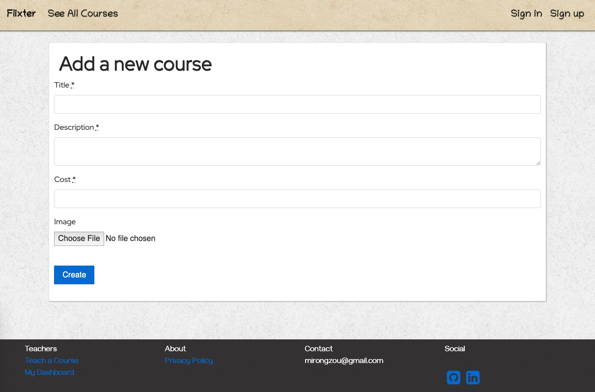

# Flixter

Flixter is a two-sided (instructor & student) online lecturing application with features of video uploading (Amazon S3), credit card payment capabilities (Stripe API), database relationships(PostgreSQL). 





### Prerequisites

What things you need to install the software:

* [VirtualBox]
* [PostgreSQL]


### Installation

First, download the project, move the project to vagrant folder, and start VirtualBox.

```sh
$ cd Flixter
$ vagrant up
$ vagrant ssh
```

Then, run database migration

```sh
$ rake db:create
$ rake db:migrate
```

Start rails server on localhost

```sh
$ rails server -b 0.0.0.0 -p 3000
```

Open localhost in your browser, you will see Nomster web application running!

### Edit Project

You can edit this project by opening directory on your code editor and editing as you wish.